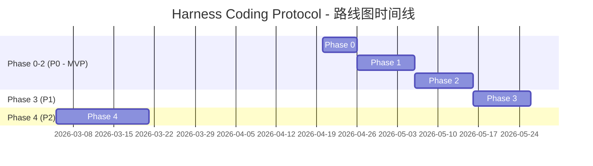

# Harness Coding Protocol Roadmap

> **最后更新**：2026-04-20  
> **定位**：AI 编码环境的全栈生态适配器（Project-Centric AI Coding Ecosystem Adapter）

## 愿景

让 `Harness Coding Protocol` 成为 **AI 编码环境的全栈生态适配器**：  
以项目为出发点，**智能检测项目特征**（技术栈、已有配置、规模、痛点），然后**推荐并适配项目可能用到的所有 AI 编码相关工具**（包括 Workflows、Skills、Hooks、Subagents、MCP Servers、Plugins、Memory 等），最终生成一套**以根级真值为核心、可增量合并、可回滚、可跨工具协作的配置结果**。

**我们不生产工具，我们是让任何项目都能最好地接入整个 AI 编码生态的适配层。**

**核心能力**：

- 识别项目现状
- 推荐最匹配的全栈 AI 工具（不限于工作流）
- 生成直接可用的适配钩子与配置
- 解释适配结果与冲突点
- 安全编排接入过程

**我们不提供自己的工作流或技能，而是让任何工作流、任何 skill、任何 MCP、任何 Hook 都能安全、方便地导入并发挥最大价值。**

Harness 的产品底座仍然是根级真值层：

- `AGENTS.md`：事实层
- `CLAUDE.md`：协议层
- `steering/`：局部覆盖层

智能化能力不是替代这三层，而是在安装与演进阶段帮助用户更快、更安全地得到适合自己项目的版本。

## 当前状态与已知问题

当前仓库仍以静态模板、安装脚本和安装后校验脚本为主，已经具备最小可用骨架，但还没有进入“检测驱动生成”的产品阶段。

当前已知问题：

- `README*`、`ROADMAP.md`、`scripts/` 与实际目录结构存在口径漂移
- 安装脚本仍有旧目录引用，和当前 `templates/` 布局不完全一致
- 校验逻辑主要覆盖路径存在性，还不足以支撑智能合并与安装编排
- 产品叙事仍停留在 starter kit，尚未完整切换到“智能适配器”定位

因此，下一阶段的首要任务不是继续堆模板，而是先收口基线，再扩展智能能力。

## 事实基线与产品策略

### 已核验的官方 / 生态事实

- `CLAUDE.md` 会在会话启动时进入 Claude Code 上下文，因此应保持简洁，只放需要常驻的信息
- Skills 适合按需加载的流程和知识，适合承接从巨型 `CLAUDE.md` 中拆分出去的内容
- Hooks 是事件驱动机制，适合做校验、格式化、保护和自动化流程，不等同于“插件安装生命周期 hook”
- Cursor 支持 `.cursor/rules/` 和 MCP，也会读取项目根的 `AGENTS.md` / `CLAUDE.md`
- MCP、Skills、Hooks 已经成为 2026 年 AI 编码环境的主流扩展形态

### Harness 选择采用的产品策略

Harness 不直接充当某个具体工作流或技能的执行框架，而是作为：

- **根级真值收敛层**
- **全栈 AI 工具适配层**
- **setup 过程编排层**

它解决的问题不是“再提供一套新模板”，而是：

- 让项目先被正确识别
- 让项目能适配**任何**工作流、**任何** skill、**任何** MCP、**任何** Hook、**任何** Subagent
- 让生成结果始终回到根级真值层
- 让跨工具协作保持一致而不失真

### 采用的策略

- 坚持“根级真值优先”，工具私有目录只做兼容层，不做事实源
- 优先做“检测 + 全栈推荐 + 生成 + 合并”，而不是继续扩展静态模板数量
- 默认不覆盖用户已有配置，优先 `dry-run`、diff、分级冲突处理
- 默认不在目标项目中自动执行高风险或高副作用操作
- 对未经核验的跨工具能力，不在产品文档中写成既成事实
- 对第三方工具采用“识别、解释、映射、建议”的适配方式，而不是强绑定或强依赖
- 支持用户一键导入/嵌套 GSD、Superpowers、G-Talk、CCG 等主流工作流，并给出“如何与 RIPER-5 / 根级真值配合”的说明

## 设计准则

### 1. 根级真值优先

所有建议配置与兼容层都必须从仓库根级真值派生，而不是反向污染真值源。

### 2. 上下文最小化 + 按需加载

把始终需要的事实保留在根级真值层，把工作流、长参考材料和任务模板尽量下沉到 Skills、局部规则或生成阶段产物，避免上下文膨胀。

### 3. Planning First（面向复杂任务）

复杂变更、跨文件生成、策略合并、安装编排优先走“先理解、再规划、后执行”的思路。小修小补不强制进入规划，但平台能力设计默认偏向可审查、可预览。

### 4. 可逆性与安全优先

所有自动化能力都必须优先支持预览、备份、回滚和跳过。任何可能破坏用户配置的行为都不能作为默认路径。

### 5. 跨工具兼容

`Harness` 的核心输出首先服务于根级真值层，目标是兼容 Claude Code、Cursor 以及其他 MCP-compatible 工具，但兼容策略必须建立在可验证能力和清晰边界上，而不是写成泛化承诺。

### 6. 智能适配、零手动优先

产品目标不是“给用户更多模板去选”，而是“先理解项目，再生成尽量少、但更正确的配置建议”，把手动复制和重复配置降到最低。

## 优先级与交付顺序

| 优先级 | 范围                        | 目标                                        |
| ------ | --------------------------- | ------------------------------------------- |
| P0     | Phase 0 + Phase 1 + Phase 2 | 收口基线，建立 Detection + 全栈推荐核心能力 |
| P1     | Phase 3                     | 把检测、生成、合并接入安装或 setup 流程     |
| P2     | Phase 4                     | 完善市场叙事、最佳实践文档与全栈推荐 bundle |

### 📊 整体状态概览

| Phase   | 目标状态                              | 优先级 | 预计完成   | 进度   |
| ------- | ------------------------------------- | ------ | ---------- | ------ |
| Phase 0 | Baseline Alignment                    | P0     | 2026-04-25 | 🔄 规划 |
| Phase 1 | Detection Engine                      | P0     | 2026-05-05 | 🔄 规划 |
| Phase 2 | Generators + 全栈推荐                 | P0     | 2026-05-15 | 🔄 规划 |
| Phase 3 | Installer Orchestration               | P1     | 2026-05-25 | 🔄 规划 |
| Phase 4 | Marketplace + Docs + 全栈推荐 Bundles | P2     | 2026-06-10 | 🔄 规划 |

**建议执行顺序**：

1. 先修正文档、脚本、模板之间的结构漂移  
2. 再实现 `Detection Engine`  
3. 基于检测结果实现 `Generators + 全栈推荐引擎`  
4. 最后把这些能力编排到 installer / setup 流程中

## Phase 0: Baseline Alignment

### 目标

在进入智能化阶段之前，先让仓库本身重新变成“可解释、可安装、可校验”的一致状态。

### 核心工作

- 修正 `scripts/`、`README.md`、`README.en.md`、`ROADMAP.md` 与 `templates/` 的口径不一致
- 让安装脚本引用的目录结构与真实仓库结构一致
- 收紧“根级真值 / 工具兼容层 / 插件元数据”三者的边界
- 让仓库能够对自己的安装产物完成自校验

### 验收标准

- 安装脚本路径引用与真实目录结构一致
- `README*`、`ROADMAP.md`、脚本中不再引用已删除目录
- 仓库可以基于当前模板完成一次自校验，且结果可解释

## Phase 1: Detection Engine

### 目标

构建项目识别引擎，在安装或 setup 之前扫描目标仓库，输出结构化检测结果，作为后续生成器和合并引擎的唯一输入。

### 检测范围

- 已有根级真值：`AGENTS.md`、`CLAUDE.md`、`steering/`
- Claude Code 线索：`.claude/settings.json`、Hooks、工作流目录、局部规则
- Cursor 线索：`.cursor/rules/`、`.cursorrules`
- MCP 线索：`mcp.json`、`package.json`、已存在 MCP 配置文件
- 技术栈：Node.js / Python / Go / Rust / Java 等项目入口文件
- 仓库形态：单仓、monorepo、前后端分层、混合工作流
- 已有 AI 工具痕迹：Skills、Hooks、Subagents、Memory 配置等

### 输出产物

- `detected-report.json`：面向用户和调试的完整检测报告
- `detected-tools.json`：面向生成器和合并引擎的标准化输入（含全栈工具检测结果）

### 目标结构

```text
templates/
└── auto-detect/
    ├── detector.ts
    ├── config/
    │   ├── patterns.json
    │   └── mappers.json
    └── fixtures/
```

### 验收标准

- 能检测现有根级真值、Claude 配置、Cursor 规则、MCP 线索、技术栈和已有 AI 工具痕迹
- 至少覆盖最小仓库、Cursor-heavy 仓库、Claude+MCP 仓库三类 fixture
- 第三方工作流检测采用“已适配列表 + 可扩展规则”模式
- 提供 `--shallow` 扫描模式
- 大型仓库扫描目标 `<= 5s`

## Phase 2: Generators + 全栈推荐引擎

### 目标

基于检测结果生成建议配置，并以“增量合并优先”的方式把建议内容映射到根级真值和可选兼容层。核心输出是**全栈 AI 工具推荐 + 适配钩子生成**。

### 核心工作

- 根据 `detected-tools.json` 生成 `AGENTS.md` 建议内容
- 根据检测到的工具、工作流和项目结构生成 `CLAUDE.md` 建议内容
- 根据技术栈和目录结构生成 `steering/` 建议内容
- **核心能力**：动态生成“全栈 AI 工具推荐报告 + 适配钩子”章节（包含 Workflows、Skills、Hooks、Subagents、MCP Servers、Plugins、Memory 等）（支持本地规则引擎，可选远程增强服务）
- 可选生成 Cursor mirror、Hook 建议、工作流建议
- 引入冲突分级与合并策略，不把覆盖写成默认行为

### 默认合并原则

- 默认模式：增量合并
- 默认入口：`dry-run` + diff 预览
- 冲突处理：按低风险可自动合并、高风险需确认两级处理
- LLM 智能合并：作为增强项提供，不作为默认承诺路径

### 目标结构

```text
templates/
└── auto-detect/
    ├── generators/
    │   ├── base-generator.ts
    │   ├── agents.generator.ts
    │   ├── claude.generator.ts
    │   ├── steering.generator.ts
    │   ├── cursor.generator.ts
    │   └── ecosystem-recommender.generator.ts   # 新增：全栈推荐引擎
    └── merge-engine.ts
```

### 紧凑伪类型

```typescript
type MergeMode = 'incremental' | 'overwrite' | 'prompt';
type ConflictResolution = 'keep-existing' | 'use-generated' | 'smart-merge';

interface MergeStrategy {
  mode: MergeMode;
  conflictResolution: ConflictResolution;
}
```

说明：

- `incremental` 对应“增量合并”
- `overwrite` 对应“覆盖”
- `prompt` 对应“询问用户”
- `smart-merge` 对应“智能合并”，但默认不启用

### 验收标准

- 能根据检测结果生成有效配置建议
- `dry-run` 必须输出清晰 diff
- 合并不能破坏用户已有配置
- PowerShell 与 bash 行为一致
- 全栈推荐报告必须包含“为什么推荐 + 使用技巧 + 适配钩子代码”

## Phase 3: Installer Orchestration

### 目标

把 Detection、Generation、Merge 串成一个可执行的安装或 setup 流程，让用户能够从“装上插件”顺滑进入“完成智能适配”。

### 设计原则

- 不使用“插件安装 hook 自动运行”这类未经确认的生命周期说法
- 采用“插件命令或安装后显式 setup 流程驱动”的叙事与实现方式
- 保留 `Silent / Confirm / Dry-run` 三种交互模式
- 回滚能力优先采用 `backup + diff/patch`，不强依赖自动 git commit

### 目标结构

```text
templates/
└── auto-detect/
    ├── installer.ts
    ├── merge-engine.ts
    └── reporters/
        ├── diff-reporter.ts
        └── summary-reporter.ts
```

### 交互模式

| 模式      | 行为                                         |
| --------- | -------------------------------------------- |
| `Silent`  | 仅在无冲突或低风险变更时自动写入，并输出摘要 |
| `Confirm` | 默认模式，输出 diff 并等待用户确认           |
| `Dry-run` | 只检测和生成，不写入文件                     |

### 验收标准

- 检测、生成、合并可以被单一入口编排
- 用户能明确看见将要写入的内容和冲突点
- 生成过程支持备份、跳过和回滚

## Phase 4: Marketplace + Docs + 全栈推荐 Bundles

### 目标

把 `Harness` 从“能用”推进到“可理解、可传播、可安装即信任”的状态。

### 核心工作

- 更新 marketplace 叙事，突出“自动适配 + 根级真值 + 安全接入 + 可回滚 + 全栈工具推荐”
- 新增 `docs/best-practices.md`，沉淀适配器设计原则与集成方式
- 新增“全栈工具适配文档”，说明 Harness 如何识别、推荐并适配工作流、skill、MCP、Hook 等
- 引入**全栈推荐 bundles**，把高价值工作流与能力组合成可选建议
- 明确推荐 bundles 为可选能力，不默认自动安装第三方插件、skills 或 MCP

### 推荐 bundle 方向（全栈）

- Planning / Review bundle（Superpowers + GSD）
- MCP productivity bundle（context7 + Playwright + GitHub MCP）
- Frontend excellence bundle（frontend-design + UI review hooks）
- Browser / Web verification bundle
- TDD + Quality bundle（TDD skills + test-writer subagent + lint hooks）

### 验收标准

- 市场描述与产品实际能力一致
- 文档能清晰说明根级真值、检测、全栈推荐、生成、合并、回滚的关系
- 推荐 bundle 具备清晰边界，不制造“自动装一切”的误解

## 非目标与风险边界

以下内容不是本路线图默认承诺范围：

- 不碰 `.git/` 等敏感目录
- 不在无提示情况下覆盖用户已有配置
- 不默认在目标项目里自动执行依赖安装
- 不把未经核验的跨工具能力写成已支持事实
- 不把工具私有目录重新提升为仓库真值
- 不把第三方工具的完整生命周期管理写成已具备能力

## 里程碑产物清单

本路线图固定以下目标结构与产物名称，后续实现默认围绕这些命名推进：

- `templates/auto-detect/detector.ts`
- `templates/auto-detect/config/patterns.json`
- `templates/auto-detect/config/mappers.json`
- `templates/auto-detect/generators/`
- `templates/auto-detect/merge-engine.ts`
- `templates/auto-detect/installer.ts`
- `detected-report.json`
- `detected-tools.json`

## 成功标准

当以下条件同时成立时，可以认为 `Harness` 已从 starter kit 成功进化为全栈生态适配器：

- 仓库自身基线一致，文档、脚本、模板和校验逻辑不再漂移
- 安装或 setup 流程能够先识别项目现状，再生成全栈推荐 + 适配配置
- 生成内容默认以增量合并和预览为中心，而不是覆盖为中心
- 用户无需理解全部内部机制，也能安全完成首次接入
- 市场叙事与产品真实能力一致，不夸大、不过度承诺


Harness 的设计大量参考了社区中已验证的优秀实践项目，重点借鉴了「检测本地项目 → 智能分析 → 生成/合并配置」的完整闭环能力。以下是核心参考项目及其对 Harness 的启发：

| 项目 | 链接 | 核心价值 | 对 Harness 的借鉴 | |------|------|----------|-------------------| | **Matt-Dionis/claude-code-configs** | [github.com/Matt-Dionis/claude-code-configs](https://github.com/Matt-Dionis/claude-code-configs) | 动态配置生成器（claude-config-composer） | 检测 → 规则驱动生成 → 增量合并 + dry-run 流程（Phase 1+2 核心参考） | | **alirezarezvani/ClaudeForge** | [github.com/alirezarezvani/ClaudeForge](https://github.com/alirezarezvani/ClaudeForge) | 代码库分析 + CLAUDE.md 自动维护 | 项目特征提取 + 增量更新机制（Generators 架构参考） | | **Agent Provisioner** | （Web 版全自动配置生成器） | 本地扫描 + 云端 LLM 推荐 + PR 生成 | Hybrid 架构验证（本地 Detection + 可选远程推荐引擎） | | **ALvinCode/cursor-rules-generators** | [github.com/ALvinCode/cursor-rules-generators](https://github.com/ALvinCode/cursor-rules-generators) | MCP Server 形式的实时规则生成 | 把推荐引擎做成独立服务的能力参考 | | **drewipson/claude-code-config** | [github.com/drewipson/claude-code-config](https://github.com/drewipson/claude-code-config) | VS Code 扩展统一管理配置 | 用户可见的检测 + 合并体验参考 |

\### 借鉴原则 - **只借鉴成熟、可验证的模式**，不盲目复制。 - 优先采用**纯本地 + 可选远程增强**的 Hybrid 架构，兼顾隐私与智能程度。 - 所有借鉴都会明确标注来源，并在代码和文档中保留致谢。

\---

---



---


---

## v2.1.0 更新：Reference Audit + 发布硬化任务

> **追加更新**：2026-04-21
> 本节记录当前实现后的下一阶段开发任务，不替换上方原始路线图。

### 当前状态

| 范围 | 状态 | 说明 |
| --- | --- | --- |
| Reference Audit | 已落地 | 新增 `docs/references.md`，标注 verified / partial 状态，并声明未复用外部项目代码 |
| 发布硬化 | 已推进 | 新增 Vitest 测试、`build/test/test:watch` scripts、package `bin` 入口 |
| CLI | 已推进 | 新增 `harness detect`、`harness setup`、`harness rollback`，保留脚本 `--smart` 入口 |
| 检测增强 | 已推进 | Detection 输出新增 `frameworks` 和 `commands`，覆盖 React/Vite、Node scripts、Python/Go 常见命令线索 |
| 体验增强 | 已推进 | `confirm` 在 TTY 环境可交互选择，非 TTY 下保持 preview-only，不阻塞 CI |

### 新增公共接口

- `npm run build`
- `npm run test`
- `npm run test:watch`
- `harness detect <target> [--shallow] [--max-depth n] [--no-write]`
- `harness setup <target> [--mode dry-run|confirm|silent] [--backup] [--shallow]`
- `harness rollback <file>`

Detection 输出新增：

- `frameworks: string[]`
- `commands: { name: string; command: string; source: string }[]`

### Reference Audit 原则

- `docs/references.md` 是参考项目的唯一审计入口。
- 当前 Harness 没有复用外部项目代码。
- 对未完整核验的参考，只写 partial，不写成已验证实现来源。
- 未来如需移植具体实现，必须先做 license review，并在代码处添加 attribution。

### v2.1.0 回归标准

- `npm run typecheck`
- `npm run test`
- `npm run build`
- `npm run validate -- .`
- `npm exec -- harness detect templates/auto-detect/fixtures/cursor-heavy --no-write`
- Bash / PowerShell 的 `scripts/apply-template.* --smart --mode dry-run`

### 后续待办

1. 增加 built `harness` 二进制的打包发布 smoke。
2. 扩展 nested monorepo 的 package-manager 命令推断。
3. 优化大型 diff 的报告格式。
4. 增加 CLI JSON 输出选项。

