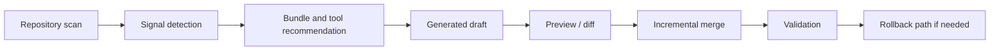

# Architecture

## Purpose

Harness Coding Protocol is built around root truth first.
The repository should make it easy for a project to know what is canonical, what is advisory, and what is only a compatibility mirror.

## Current Architecture

The repo now has both a static layer and a first-pass smart layer:

- `AGENTS.md` holds factual repository state
- `CLAUDE.md` holds protocol and collaboration rules
- `steering/*.md` adds scoped guidance
- `docs/` explains how the system is meant to be used
- `docs/bundles/*.md` defines recommendation packs
- `templates/auto-detect/detector.ts` scans repository signals
- `templates/auto-detect/generators/` creates candidate files and recommendation reports
- `templates/auto-detect/merge-engine.ts` prepares low-risk incremental merge output
- `templates/auto-detect/installer.ts` orchestrates dry-run, confirm, silent, backup, and rollback helpers

## Smart Flow

The smart layer is intentionally bounded:

The target flow is intentionally conservative:

- detect before writing
- recommend before installing
- preview before merge
- rollback before trust

## Core Layers

| Layer | Responsibility | Example |
|------|----------------|---------|
| Root truth | Canonical project facts and rules | `AGENTS.md`, `CLAUDE.md` |
| Local guidance | Scoped instructions for a path or stack | `steering/frontend.md` |
| Compatibility mirror | Tool-specific file that reflects root truth | Cursor or Kiro mirrors |
| Recommendation bundle | Suggested tool/workflow combination | Planning / Review bundle |
| Smart adapter | Detect and generate pipeline | Detection, generation, merge, installer |

## Current vs Future

Current behavior should stay easy to reason about:

- static mode is usable without the smart layer
- smart mode is available as a local first-pass implementation
- bundle docs are recommendations, not background installers

Future hardening should stay reversible:

- all generated changes should be reviewable
- write actions should support dry-run or diff output
- incompatible changes should remain opt-in

## Non-Goals

- Do not treat tool-private files as root truth
- Do not promise automatic support for every third-party workflow
- Do not hide merge behavior behind silent mutation
- Do not require users to understand the internal pipeline before getting value
- Do not imply external reference projects are code dependencies; see `docs/references.md`
