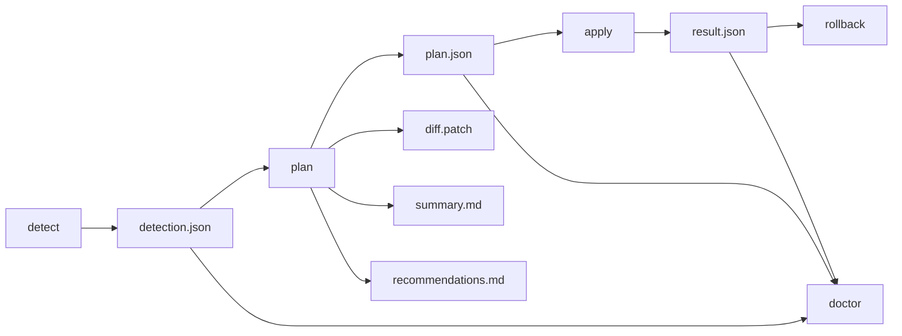

# Architecture

Harness Coding Protocol is a plan-first adapter for AI coding tools. Its job is to make repository guidance reproducible: detect the project, produce a saved plan, apply only that saved plan, and leave artifacts that another tool can read without recalculating anything.

## Design Goals

- Root truth stays in repository-level guidance: `AGENTS.md`, `CLAUDE.md`, and `steering/*.md`.
- `plan` is the core command. `setup` is only orchestration around `detect`, `plan`, and `apply`.
- Every CLI run writes `.harness/runs/<run-id>/` so behavior can be replayed and debugged.
- Default stdout stays short. Full detail goes to artifact files.
- Claude and Cursor adapters are thin wrappers. They call the CLI and translate saved artifacts for the user.

## Core Flow

## Layers

| Layer | Responsibility | Key files |
| --- | --- | --- |
| Run contract | Creates run ids, manifests, and artifact persistence | `templates/auto-detect/run-contract.ts` |
| Detection | Reads project signals and normalizes findings | `templates/auto-detect/detector.ts` |
| Planning | Generates candidate changes, diff, summary, and recommendations | `templates/auto-detect/installer.ts`, `templates/auto-detect/generators/` |
| Applying | Reads a saved plan and writes selected changes | `templates/auto-detect/installer.ts` |
| CLI rendering | Keeps stdout concise and maps failures to stable exit codes | `templates/auto-detect/cli.ts` |
| Tool adapters | Thin wrappers for Claude and Cursor | `.claude/commands/`, `templates/adapters/cursor/` |

## Command Responsibilities

| Command | Responsibility | Writes target config? |
| --- | --- | --- |
| `detect` | Scan target and save `detection.json` | No |
| `plan` | Build saved plan, diff, summary, and recommendation report | No |
| `apply` | Read `plan.json` and write selected changes | Yes |
| `rollback` | Restore the latest successful apply or file backup | Yes |
| `doctor` | Diagnose artifacts and rollback availability | No |
| `setup` | Compose detect + plan + apply | Only when confirmed or allowed by mode |

## Invariants

- `plan` and dry-run modes may write run artifacts, but must not write generated project guidance files.
- `apply` must read a saved `plan.json`; it must not call detection or generation again.
- Low-risk automatic writing is limited to conflict-free creates or Harness-marker updates.
- User-owned files without Harness markers stay opt-in.
- `diff.patch` and `summary.md` are outputs of the plan run, not regenerated by adapters.
- `--json` emits one compact machine-readable line.

## Adapter Boundary

Claude and Cursor should do only three things:

1. Run the Harness CLI.
2. Read `.harness/runs/<run-id>/` artifacts.
3. Present a concise translation to the user.

They should not independently infer project state, risk, recommendations, or diffs. If artifacts are missing or inconsistent, the correct next step is `harness doctor`, not a best-effort recomputation inside the adapter.

## Non-Goals

- Harness does not install third-party AI tools by default.
- Harness does not treat tool-private files as repository truth.
- Harness does not hide writes behind verbose stdout.
- Harness does not make cleanup decisions about old run artifacts unless an explicit cleanup command is added.

See `docs/run-contract.md` for the artifact schema and persistence contract.
